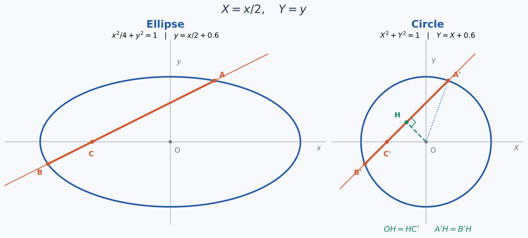

+++
date = '2026-09-19T23:09:00+08:00'
draft = false
title = '把椭圆变成圆：用几何看懂切线与弦长'
description = '通过坐标伸缩把椭圆化为圆，推导切点坐标与一个弦长平方和恒等式，并说明哪些几何关系可以保留。'
tags = ['Maths', '椭圆', '解析几何', '坐标变换']
math = true
ShowToc = true
+++

做椭圆题时，我有时会先停一下：如果把这个椭圆压成一个圆，问题会不会简单一些？圆有许多直观的几何性质，切线、半径、弦中点之间的关系一眼就能看出来。通过适当的坐标伸缩，这些性质也能帮助我们处理椭圆问题。

<!--more-->

下面整理两个例子：先用圆的切线性质求椭圆的切点，再用弦中点和勾股定理解释一个长度平方和。关键是始终分清变换前后的坐标，以及长度究竟怎样变化。

## 一、把椭圆化为圆，直线怎样变化？

考虑椭圆

$$
\frac{x^2}{a^2}+\frac{y^2}{b^2}=1,\qquad a>b>0.
$$

令

$$
X=\frac{x}{a},\qquad Y=\frac{y}{b},
$$

它就变成了单位圆

$$
X^2+Y^2=1.
$$

这个变换把横、纵坐标分别除以 $a$、$b$。它可逆，因此直线与椭圆的交点会一一对应到直线与圆的交点；相交、相切的关系都能保留。

如果原直线是

$$
y=kx+m,
$$

代入 $x=aX$、$y=bY$，得到

$$
Y=\frac{a}{b}kX+\frac{m}{b}.
$$

所以新的斜率和纵截距分别是

$$
\boxed{k'=\frac{a}{b}k},\qquad
\boxed{m'=\frac{m}{b}}.
$$

这里有一个容易写错的细节：**斜率应当用坐标差的比值计算**，即 $k=\Delta y/\Delta x$。只有直线经过原点时，才能直接写成 $y/x$。用坐标差也能看清变换规律：

$$
k'=\frac{\Delta y/b}{\Delta x/a}=\frac{a}{b}k.
$$

## 二、用圆的半径求椭圆的切点

设直线 $y=kx+m$ 与椭圆相切。变换之后，它与单位圆也相切。将新直线写成

$$
-akX+bY=m.
$$

从圆心到这条直线的距离等于半径 $1$，因此

$$
\frac{|m|}{\sqrt{a^2k^2+b^2}}=1,
$$

于是相切条件就是

$$
\boxed{m^2=a^2k^2+b^2}.
$$

接着求切点。圆的半径在切点处垂直于切线，而向量 $(-ak,b)$ 正好垂直于这条直线。所以单位圆的切点 $T'$ 可以写成

$$
T'=\lambda(-ak,b).
$$

将它代入直线方程，得到

$$
\lambda(a^2k^2+b^2)=m.
$$

再利用相切条件，便有 $\lambda=1/m$。这里 $m\ne0$，因为 $a^2k^2+b^2>0$。于是

$$
T'=\left(-\frac{ak}{m},\frac{b}{m}\right).
$$

最后把横坐标乘回 $a$、纵坐标乘回 $b$，得到椭圆上的切点

$$
\boxed{T=\left(-\frac{a^2k}{m},\frac{b^2}{m}\right)}.
$$

若记 $D=\sqrt{a^2k^2+b^2}$，那么给定斜率 $k$ 时，两条平行切线分别对应

$$
\begin{aligned}
m=D:&\quad T_+=\left(-\frac{a^2k}{D},\frac{b^2}{D}\right),\\
m=-D:&\quad T_-=\left(\frac{a^2k}{D},-\frac{b^2}{D}\right).
\end{aligned}
$$

**这两个点属于两条不同的切线**。对已经给定的 $y=kx+m$，应由 $m$ 的正负确定切点。

这个写法也包含 $k=0$ 的情况，即切线 $y=\pm b$。竖直切线不能写成 $y=kx+m$，需要单独补上：它们是 $x=\pm a$，切点为 $(\pm a,0)$。

## 三、弦长平方和：先在圆上看清结构

笔记中的另一个思路，来自长短轴之比为 $2$、直线斜率为 $1/2$ 的情形。把有关条件单独整理出来：

椭圆为

$$
\frac{x^2}{4b^2}+\frac{y^2}{b^2}=1,
$$

直线 $y=\tfrac12x+m$ 与椭圆交于两个不同的点 $A,B$，与 $x$ 轴交于 $C$。我们考察 $AC^2+BC^2$。

这一次只把横坐标除以 $2$，纵坐标保持不变：

$$
X=\frac{x}{2},\qquad Y=y.
$$

椭圆变成半径为 $b$ 的圆，直线的斜率从 $1/2$ 变为 $1$：

$$
X^2+Y^2=b^2,\qquad Y=X+m.
$$

用 $A',B',C'$ 表示对应的点，从圆心 $O$ 向弦所在直线作垂线，垂足为 $H$。

*图中取 $b=1$、$m=0.6$ 作示意。左图横坐标除以 $2$ 后得到右图；垂直关系是在右图的圆上使用的。*

圆的垂径定理给出

$$
A'H=B'H.
$$

因为弦所在直线的斜率为 $1$，它与水平轴成 $45^\circ$，所以直角三角形 $OHC'$ 是等腰直角三角形，从而

$$
OH=HC'.
$$

当 $m=0$ 时，$H=C'=O$，这个等式也成立。

现在利用 $H$ 是弦中点这一点，就有

$$
A'C'^2+B'C'^2=2A'H^2+2HC'^2.
$$

这个恒等式不要求 $C'$ 一定在弦的内部。沿直线以 $H$ 为原点，令 $A',B',C'$ 的有向坐标分别为 $s,-s,t$，它就是

$$
(s-t)^2+(-s-t)^2=2s^2+2t^2.
$$

再代入 $HC'=OH$，并对直角三角形 $OA'H$ 使用勾股定理：

$$
\begin{aligned}
A'C'^2+B'C'^2
&=2(A'H^2+OH^2)\\
&=2OA'^2\\
&=\boxed{2b^2}.
\end{aligned}
$$

看起来要展开很多项的式子，在圆上归结为弦中点、等腰直角三角形和勾股定理。

## 四、回到椭圆，长度还要换算

上面的 $2b^2$ 是**变换后的圆上**的结果，不能直接当作原椭圆上的答案。

在圆上，这条直线的斜率为 $1$，沿线任意一段的坐标差可写为 $(u,u)$。变回椭圆后，坐标差变成 $(2u,u)$，所以长度平方分别为

$$
\ell'^2=u^2+u^2=2u^2,\qquad
\ell^2=(2u)^2+u^2=5u^2.
$$

因此沿着这条直线，长度平方统一乘以 $5/2$。最终得到

$$
\boxed{AC^2+BC^2=\frac52\cdot2b^2=5b^2}.
$$

由于这里 $a=2b$，也可以写成

$$
\boxed{AC^2+BC^2=a^2+b^2}.
$$

关键并非整个平面的长度都按同一个比例改变，而是 **$AC$ 和 $BC$ 都在同一条直线上，因此有相同的长度缩放比例**。

## 五、哪些性质可以带过去？

这种坐标伸缩是可逆的线性变换，也是仿射变换的一种。它保留共线、平行、交点、切线，以及同一直线上线段的比例，所以中点关系也保留。

但它通常**不保留长度、角度和垂直关系**。圆上“半径垂直于切线”的性质，必须在变换后的圆上使用；变回椭圆后，中心到切点的连线一般并不垂直于切线。涉及长度时，也要像上面的例子一样，按照线段方向重新换算。

至于双曲线，它同样可以用坐标伸缩化简，但

$$
\frac{x^2}{a^2}-\frac{y^2}{b^2}=1
\quad\longrightarrow\quad
X^2-Y^2=1.
$$

负号并不会消失。双曲线不能通过这里使用的实数可逆线性变换变成圆，因此不能直接照搬这套圆的几何方法。

## 最后的一点体会

我最初把这些想法记成一种几何直觉。整理以后发现，只要把变换关系和适用条件交代清楚，它们就能成为严谨的推导。

以后遇到椭圆的切线、弦或中点问题，我会多想一步：能不能先把它变成圆？在圆上看清结构，再把坐标和长度认真换回来，有时就能省下不少计算。
