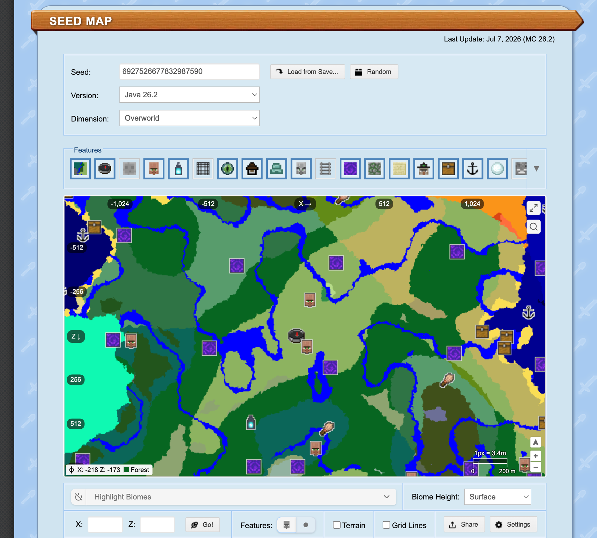

+++
date = '2026-07-12T00:15:00+08:00'
draft = false
title = 'A Lucky Minecraft Seed I Found: 6927526677832987590'
tags = ['Minecraft', 'Gaming', 'Seed']
ShowToc = true
+++

In survival mode, the first few minutes often come down to pure luck. This time, on **Java 26.2**, I rolled a genuinely incredible seed — **6927526677832987590** — packed with resources, great terrain, and even the speedrunner's dream combo of a Nether Fortress right at the portal exit plus a Blaze spawner just steps away. Here is a breakdown of the early-game route, both as a personal record and a reference for anyone who wants to recreate it.

<!--more-->

> The image above is from [ChunkBase](https://www.chunkbase.com/) (Java 26.2). Each villager icon marks a village — the spawn area is remarkably dense with structures.

## Spawn Point: Two Villages

Stepping into the world is already a good omen: there are **two villages** near spawn.

- **Close village**: roughly 100 blocks away — practically at your feet.
- **Far village**: 200–300 blocks out, perfect as a backup supply base and "second home."

Spawning near a village means beds, food, and free gear from the blacksmith chest are all handled, completely skipping the most miserable part of night one.

## Hidden Bonus in the Close Village: A Lava Pool

What truly elevates this seed is that the **close village comes with its own lava pool**.

In Minecraft, building a Nether portal requires obsidian, which you make by pouring water onto lava. Having a ready-made lava pool means no hunting for lava and no hauling a stack of buckets across the map —

> Just pour water over the village lava pool to make obsidian and build the Nether portal right there on the spot.

Entering the Nether on day one is a genuinely absurd pace.

## Step Through the Portal and You Are Already in the Fortress

It gets even more ridiculous once you cross over. When you step out of the portal in the Nether, **you come out essentially inside a Nether Fortress** — no searching required.

Walk **40–50 blocks** along the fortress and you will run straight into a **Blaze spawner**.

Blaze Rods are essential for both the brewing stand and reaching the End — Blaze Powder fuels potions and crafts Eyes of Ender. Normally players wander a fortress for ages before finding a spawner; this seed drops one right in front of you. Farm a few stacks of Blaze Rods and the ticket to the End is yours.

## Back in the Overworld: Flat Terrain and a Canyon Full of Iron

The Overworld early game is equally comfortable.

- **Flat terrain around spawn**: great for building immediately without needing to level ground first.
- **A canyon right next door**: canyons are natural ore showcases where exposed veins are visible at a glance. This one yields **40–50 iron ore**, more than enough for a full iron armor set, iron tools, and buckets.

## Early-Game Route Summary

Stringing all of the above together, the opening sequence for this seed looks roughly like this:

1. Spawn → head straight to the **close village** ~100 blocks away; grab a bed and food, get settled.
2. Drop into the canyon and mine **40–50 iron**; craft full iron armor, an iron pickaxe, and buckets.
3. Pour water on the **village lava pool** to make obsidian; build the Nether portal.
4. Enter the Nether — **portal exits inside the fortress**; walk 40–50 blocks to the **Blaze spawner** and farm enough Blaze Rods.
5. Return to the Overworld, brew potions, trade with Endermen for Ender Pearls, and get ready for the End.

From a fresh world to fully geared up for the End, almost every step is direct. The luck is genuinely unreal.

## Seed Details

| Item | Details |
| --- | --- |
| Seed | `6927526677832987590` |
| Version | Java 26.2 |
| Close village distance | ~100 blocks |
| Far village distance | ~200–300 blocks |
| Highlights | Village lava pool, Nether Fortress at portal exit, nearby Blaze spawner, canyon iron near spawn |

> Note: seed generation is tightly tied to version. Everything above was tested on **Java 26.2**. Results may differ on other versions or on Bedrock Edition — make sure your version matches before trying to recreate this.

Good luck rolling a seed this nice yourself.
